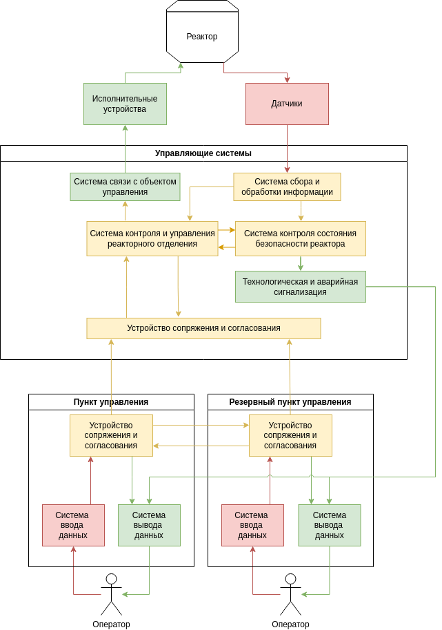

## АСУ ТП атомной электростанции
## Краткое описание назначения и применения продукта
Автоматизированная система управления технологическим процессом атомной станции  – это совокупность программно-технических средств (рабочих станций и серверов с установленным системным программным обеспечением, коммутаторов, устройств синхронизации времени и так далее), объединенных в локальную вычислительную сеть волоконно-оптическими линиями связи.

Она предназначена для автоматизации контроля технологических процессов производства электроэнергии.
____
## Ценности продукта
АСУ ТП для атомных станций должна обладать следующими свойствами:
* Надежность
* Резервирование
* Разнообразие (применяется разная аппаратура и разное программное обеспечение)
* Независимость
* Безопасность:
    * Радиационная
    * Противопожарная
    * Информационная

Ценности системы:
* Выработка электроэнергии
* Результаты исследований

____
## Неприемлемые события или сценарии в отношении ценностей продукта
### Ложное срабатывание системы защиты реактора
1. Система ошибочно регистрирует критическое состояние реактора
2. Система уведомляет оператора о критическом состоянии реактора
3. Система запускает аварийную остановку реактора
4. Система запускает аварийное охлаждение топлива в реакторе
5. Система уведомляет оператора о запуске аварийных систем
### Несрабатывание системы защиты реактора в случае критической ситуации (рост температуры топлива)
1. Система регистрирует критическое состояние реактора
2. Система уведомляет оператора о критическом состоянии реактора
3. Система пытается запустить аварийное охлаждение топлива в реакторе
4. Система получает ошибку/отказ от подсистемы аварийного охлаждения топлива
5. Система уведомляет оператора об отказе подсистемы аварийного охлаждения топлива
6. Система пытается запустить дублирующую подсистему аварийного охлаждения топлива
7. Система получает ошибку/отказ от дублирующей подсистемы аварийного охлаждения топлива
8. Система уведомляет оператора об отказе дублирующей подсистемы аварийного охлаждения топлива
9. Система уведомляет оператора о необходимости ручного запуска подсистемы аварийного охлаждения топлива
10. Инженер производит попытку ручного запуска подсистемы аварийного охлаждения реактора
____
## Основные сценарии использования
### Остановка ядерного реактора
1. Оператор подает системе сигнал на остановку реактора
2. Система проверяет необходимые условия для выполнения остановки
3. Система начинает процесс введения управляющих стержней в активную зону
4. В процессе введения стержней система контролирует основные показатели работы реактора
5. После полного введения стержней система проверяет условия остановки реактора и количество избыточных нейтронов
6. Система отправляет оператору уведомление об остановке реактора
____
## Цели и предположения безопасности
### Цели безопасности
1. В любой момент времени система работает с целостной информацией о состоянии подсистем
2. В любой момент времени система контролирует технологические процессы
### Предположения безопасности
1. Потенциальный злоумышленник не имеет доступ к подсистемам и модулям управления на станции
2. Сотрудники, работающие на станции благонадежны
3. Материалы и конструкции, используемые для работы реактора не имеют дефектов и повреждений
____
## Политика архитектуры

